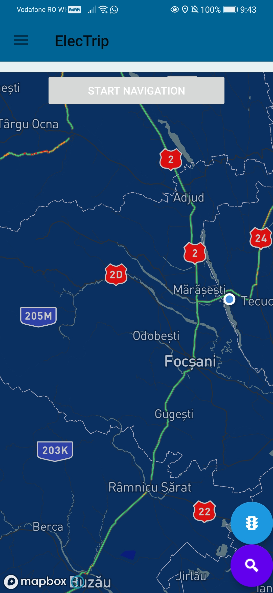
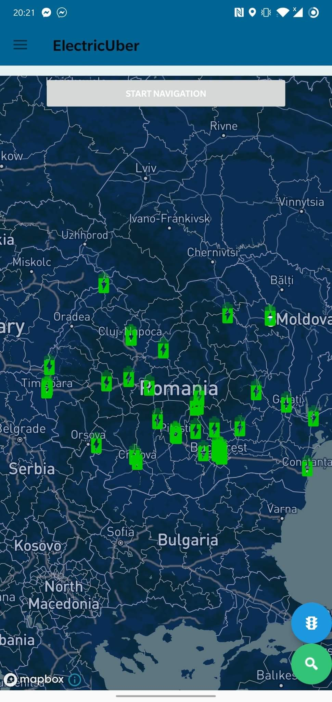
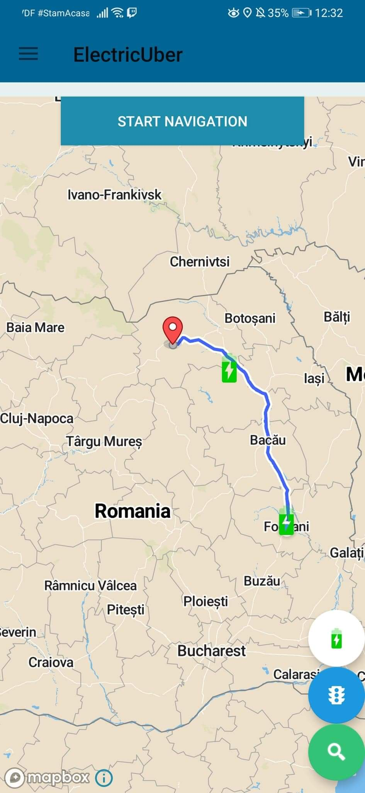
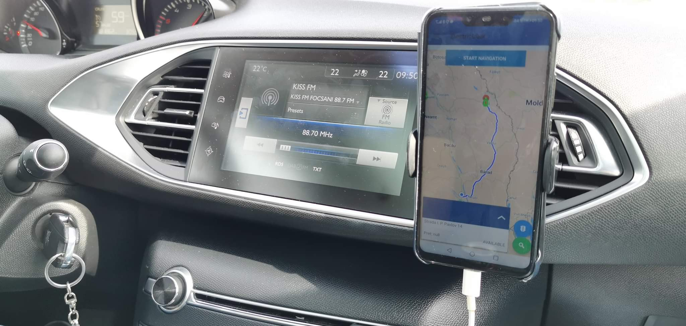

# ElecTrip
An application meant to assist electric car drivers when travelling long distances by computing the best path in accordance with the car's remaining battery and the locations of the charging stations along the way.

For the app development we used services provided by www.mapbox.com.

Full promotional video at: https://www.youtube.com/watch?v=MjQ3TVg_3v8

API repository: 
https://github.com/NiceDayZ/UberForElectricCarsAPI
